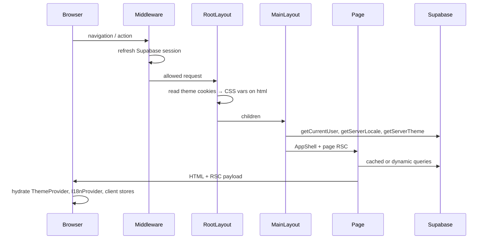

# Amadeus Architecture

Next.js App Router 풀스택 앱. 별도 백엔드 서버 없이 **RSC + Server Actions + Route Handlers + Supabase** 로 구성됩니다.

## Directory Layers

```
app/                 Route segments, layouts, loading UI, API routes
features/            Domain logic (auth, chat, personas, ai, …)
shared/              Cross-cutting UI, config, i18n, theme, Supabase clients
supabase/migrations/ Postgres schema + RLS
```

| Layer | Responsibility | Examples |
| ----- | -------------- | -------- |
| `app/` | HTTP entry, routing, segment config | `(main)/page.tsx`, `api/chat/stream` |
| `features/` | Business rules, server actions, domain UI | `chat/actions/chat.ts`, `personas/queries/` |
| `shared/` | Design system, env, clients, preferences | `theme/`, `lib/supabase/`, `components/ui/` |

**Import rule:** `app → features → shared`. Features must not import from `app/`.

---

## Request Lifecycle

Each HTTP request flows through these phases (see `shared/config/lifecycle.ts`):



### Phase details

1. **Middleware** (`middleware.ts`) — Supabase session refresh; redirect unauthenticated users away from `/chat`, `/characters/*`.
2. **Root layout** (`app/layout.tsx`) — Applies theme/accent CSS variables from cookies (no flash).
3. **Main layout** (`app/(main)/layout.tsx`) — Loads user, locale, theme once; wraps `AppShell`.
4. **Page** — Server Components fetch data; public catalog uses cache (below).
5. **Client hydration** — Zustand stores (locale, theme, chat draft); settings changes write cookies + `router.refresh()`.

---

## Auth Lifecycle

Web and desktop share Supabase OAuth but finish differently:

```text
Web:  /auth/callback?code=... → exchangeCodeForSession → cookie → redirect /
Desktop (Tauri bundle): /auth/callback?code=...&state=...
  → exchange fails (PKCE verifier in app)
  → 302 amadeus://auth/callback?code=...&state=...
  → Tauri completes session locally
```

Optional explicit desktop marker: `?client=desktop` skips web exchange and opens the app bridge immediately.
Scheme env: `NEXT_PUBLIC_DESKTOP_AUTH_SCHEME` (default `amadeus`).

Desktop bundle `redirectTo`:

```text
https://amadeus0.kro.kr/auth/callback?client=desktop
```

| Phase | Trigger | Result |
| ----- | ------- | ------ |
| `anonymous` | No session cookie | Public pages + catalog browse |
| `oauth-redirect` | Google sign-in click | Redirect to Supabase OAuth |
| `callback-exchange` | `/auth/callback?code=` (web) | Session cookie set |
| `callback-desktop-bridge` | `/auth/callback?code=&state=` (desktop PKCE) | `302 → amadeus://auth/callback?...` |
| `persona-provision` | After OAuth | Copy catalog personas to user (if missing) |
| `authenticated` | Valid session | Chat, protected routes |

---

## Chat Lifecycle

| Phase | UI | Server |
| ----- | -- | ------ |
| `idle` | Detail page | — |
| `starting` | "로딩 중입니다..." button | `startConversation()` |
| `loading-room` | `chat/[id]/loading.tsx` | `getConversation`, `getMessages` |
| `sending` | User message bubble | `saveUserMessage` |
| `streaming` | Assistant stream | `POST /api/chat/stream` |
| `error` | Inline error | Retry |

Data stores: `cloud_conversations`, `cloud_conversation_messages`, `persona_states`.

---

## Web & Sync

Web ↔ Desktop sync contract (full platform doc: pairing, sync queue, payload allowlist).

### Web owns

- Signup/login UI, persona editor (future), cloud chat UI, device pairing UI (future)
- Server-side LLM calls only (never expose API keys to browser)

### Web does not own

- Desktop raw work context, local triggers, local LLM process, local private memory

### Conversation sync (implemented)

Canonical identity: **one active `cloud_conversations` row per `(user_id, persona_id)`**.

| Layer | Rule | Code |
| ----- | ---- | ---- |
| Conversation | App/web share one thread per persona | `006_conversation_dedupe.sql`, `resolveCanonicalConversationId()` |
| Message dedupe | `(user_id, conversation_id, idempotency_key)` unique | `upsertCloudMessage()` |
| Message order | `client_created_at → source_device_id → client_sequence → server_received_at → id` | `sortCloudMessages()` |
| Web surface | `surface = web` | `SYNC_SURFACES.web` |
| App surface | `surface = app` (desktop upsert path) | mirrored into SQLite as `web_mirror` on app |
| List UI | One row per persona slug after merge | `getConversations()` + `dedupeConversationsBySlug()` |
| Race safety | Unique index + retry resolve on `23505` | `startConversation()` |

```text
App SQLite (pending)
  -> Supabase upsert_cloud_conversation_message (idempotency_key)
  -> ack with cloud_message_id

Web Server Action
  -> upsertCloudMessage (idempotency_key from client)
  -> touchConversationLastMessage

Supabase cloud_conversation_messages
  -> App pull + dedupe by idempotency_key / cloud_message_id
```

### Auth boundary (web routes)

| Route / Action | Auth | Client |
| -------------- | ---- | ------ |
| Persona CRUD | yes | user-scoped Supabase |
| Cloud chat | yes | user-scoped + server LLM key |
| Pairing (later) | yes | user-scoped → Edge Function |
| Public catalog | no | cookie-less public client |

Service role is **not** used in this Next.js app.

---

## Caching Strategy

Config: `shared/config/cache.ts`

| Data | Strategy | TTL | Notes |
| ---- | -------- | --- | ----- |
| Catalog personas (home) | `unstable_cache` + ISR `revalidate` | 300s | Public Supabase client (no cookies) |
| Persona detail (by id) | `unstable_cache` per id | 300s | Tagged for future invalidation |
| Search/filter (`?q=`) | **Bypass** | — | Always fresh query |
| User chat / auth | **Dynamic** | — | Cookie-scoped Supabase client |
| Supabase server client | `React.cache()` | per request | Dedupes within one RSC tree |

### Cache lifecycle

- **hit** — Catalog served from Next.js data cache
- **miss** — Supabase fetch, then stored for `revalidate` window
- **bypass** — Search params or user-specific paths skip cache

---

## Preferences Lifecycle (Settings)

All user preferences live in **`/settings`** and persist via cookies:

| Preference | Cookie | Client store |
| ---------- | ------ | ------------ |
| Language | `amadeus_locale` | `useLocaleStore` |
| Theme mode | `amadeus_theme` | `useThemeStore` |
| Accent color | `amadeus_accent` | `useThemeStore` |

Flow: Settings UI → Zustand + cookie → `router.refresh()` → server reads cookie on next RSC render.

---

## Routing Performance

- **`loading.tsx`** — Instant skeleton for `/characters/[id]`, `/chat/[id]`, main list
- **Link prefetch** — Persona cards prefetch on viewport + hover/focus
- **`optimizePackageImports`** — Tree-shake `react-icons` in `next.config.ts`
- **No page-enter animation** — Removed template transition for snappier navigations
- **Parallel layout fetch** — `Promise.all([user, locale, theme])` in main layout

---

## AI Pipeline

```
Client ChatRoom → saveUserMessage (Server Action)
                → POST /api/chat/stream (Route Handler)
                → buildPersonaSystemPrompt(static_prompt_json)
                → Gemini / OpenAI / mock provider (LLM_PROVIDER env)
                → SSE stream → saveAssistantMessage
```

---

## Environment

See `.env.local.example`. Required: Supabase URL/anon key. Optional: `LLM_PROVIDER`, `GEMINI_*`, `OPENAI_*`.

---

## Scripts

| Command | Purpose |
| ------- | ------- |
| `pnpm dev` | Development |
| `pnpm build` | Production build |
| `pnpm db:migrate` | Apply Supabase SQL |
| `pnpm db:verify` | Check DB connectivity |
| `pnpm llm:verify` | Test LLM API keys |
